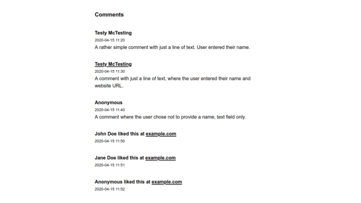
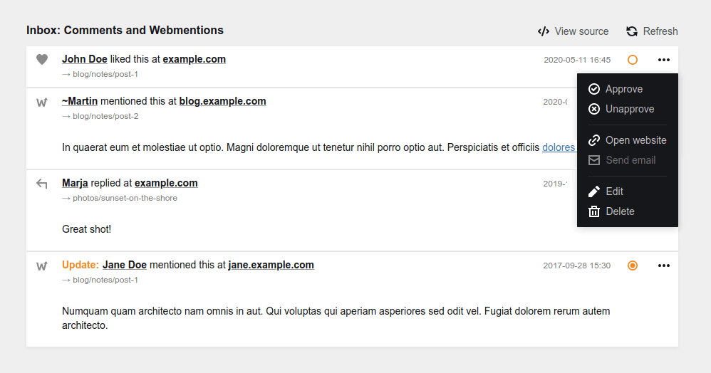

# Kirby 3 Commentions

⚠⚠⚠ **Please note: Due to the "Release Candidate" flag on the 2 June 2020 version, the composer command described below fetched an outdated "stable" version. Please [update your copy of the plugin](#installation) to the latest v1.0.0 (now available on Composer as stable).** ⚠⚠⚠

A versatile comment system and integrated Webmention endpoint for [Kirby CMS](https://getkirby.com).

- Comments can be submitted through a form on the page or as a [Webmention](https://indieweb.org/webmention)
- Incoming webmentions are stored in a queue and processed asynchronously
- Comments can be approved/deleted in the Panel
- A range of methods, API endpoints and hooks allow to build custom frontends, applications, and flows on top
- Supports multilingual sites and virtual pages

For more background and the philosophy behind this solution, read ["Designing a commenting system with data ethics in mind"](https://sebastiangreger.net/2020/06/commentions-comments-and-data-ethic).

> Versions 1.x (June 2020 and later) are **no longer compatible with the experimental 0.x versions**. After upgrading, you will have to follow the [version migration instructions](/.github/VERSIONMIGRATION.md); a migration tool assists in converting existing commention data to the new storage format.

_NB. The plugin only covers incoming webmentions, i.e. receiving notifications from other websites that link to a page. Sending outgoing webmentions to other websites requires a separate solution, such as [Kirby 3 Sendmentions](https://github.com/sebastiangreger/kirby3-sendmentions) (which has recently been updated as well)._

## Table of contents

* [Ethics and privacy](#ethics-and-privacy)
* [Installation](#installation)
* [Setup](#setup)
* [Frontend helper](#frontend-helper)
* [Panel sections](#panel-sections)
* [Page methods](#page-methods)
* [Pages methods](#pages-methods)
* [API endpoints](#api)
* [Hooks](#hooks)
* [Data structure and storage](#data-structure-and-storage)
* [Config options](#config-options)
* [Requirements, credits, license](#requirements)

## Ethics and privacy

**Before implementing the functionalities enabled by this plugin, it is strongly advised to carry out an ethical and legal assessment.** By enabling users to post comments and/or by processing webmentions, a website deals with what is considered personal data in most jurisdictions. The processing of personal data is subject to often very strict privacy laws, coming with a potentially wide range of obligations. Legal aspects aside, dealing with other people's data always comes with ethical implications.

> Data ethics or "GDPR compliance" are never created by software, but by the way it is used. While this plugin aims to provide means for its responsible and legally compliant use, responsibility for ethical conduct and compliance with applicable laws ultimately rests with the operator of the website (aka. "the data controller"). If in doubt, always ask a qualified lawyer - and if this plugin does not meet your requirements, create a Github issue, don't use it, or adapt it to your needs.

## Installation

### Recommended: Composer

```bash
composer require sgkirby/commentions
```

### Alternatives

This plugin relies on two libraries not included in the repository due to potential licensing issues ([html-php5](http://masterminds.github.io/html5-php/) and [HTML Purifier](http://htmlpurifier.org/); used for filtering, analysing and formatting HTML input). The Composer method takes care of installing these dependencies. Alternatively, when installing as Git submodule or via download, the plugin [kirby-sanitizer](https://github.com/avoskitchen/kirby-sanitizer) should be installed as well, making the missing libraries available.

_NB. The Panel sections present an alert until all dependencies have been installed correctly, as their absence significantly limits the functionality of this plugin._

#### Git submodule

```bash
git submodule add https://github.com/sebastiangreger/kirby3-commentions.git site/plugins/kirby3-commentions
```

#### Download

Download and copy this repository to `/site/plugins/kirby3-commentions`.

## Setup

### Step 1: Template-based activation

The plugin only accepts incoming comments and/or webmentions for page templates defined in setup. To activate the plugin for certain templates, add their names to either or both of the [template-specific configuration arrays](#activate-by-template) in the `site/config/config.php`:

```php
'sgkirby.commentions.templatesWithComments' => ['note', 'article'],
'sgkirby.commentions.templatesWithWebmentions' => ['note'],
```

_NB. Not setting either of these leads to a "configuratin error" message in the panel. If not accepting any comments or webmentions is your intention, setting these as empty arrays removes the error message._

### Step 2: Adding the Commentions UIs to the Panel blueprints

All comments are stored in small text files attached to each page in the Kirby CMS. In order to display and manage them, it is required to add [panel sections](#panel-sections) to your panel blueprints (general instructions about blueprints in the [Kirby guide](https://getkirby.com/docs/guide/blueprints/introduction)).

#### Page-specific list of comments

To display and manage the comments for each page, add the following to the according blueprint in `site/blueprints/pages` (i.e. to all page blueprints where you want to use comments):

```yaml
# in the blueprint of a page with comments
sections:
  commentions:
    type: commentions
```

By default, newest comments are shown on top; this is to ensure you immediately notice new, unapproved comments. If you prefer sorting by ascending date, add the `flip` property as follows:

```yaml
# in the blueprint of a page with comments
sections:
  commentions:
    type: commentions
    flip: true
```

#### Adding a "comments inbox" to a blueprint

To approve/delete incoming comments, add the following to a suitable blueprint; e.g. to `site/blueprints/site.yml` if you want the Commentions inbox to be displayed in the main Panel view of your site:

```yaml
# in a blueprint where the inbox should be shown
sections:
  commentions:
    type: commentions
    show: pending
```

Alternatively, `pending` can be replaced with `all`, in which case all comments (pending and approved) are displayed. This may be useful in setups where new comments are set to be approved automatically.

_NB. If you leave out the `show` attribute, the comments of the page itself are displayed instead (as described above). If you are embedding the inbox on a page that also receives comments/webmentions itself, you would have to set up two sections of `type: commentions`, one for the page comments and one for the inbox._

### Step 3: Adding frontend UIs to your templates

The plugin comes with a set of default snippets to display lists of approved comments and a comment form in the frontend. These are optimized for the Starterkit but might be of use in other themes as well; they can also serve as boilerplates for designing your own (general instructions in the Kirby guide: [templates](https://getkirby.com/docs/guide/templates/basics), [snippets](https://getkirby.com/docs/guide/templates/snippets))

To show comments on pages and display a form to leave new comments, there are three options:

#### Option A. Add everything at once

In order to add everything at once, add helper [`commentions()`](#commentions) to the according templates in `site/templates` - a shorthand for the three helpers described in alternative B:

```php
<?php
  // in a page template or snippet
  commentions();
?>
```

This is your one-stop-shop, and it should sit rather nicely at the bottom of your content (in the Starterkit theme, add it right after the `</article>` tag in `site/templates/note.php` for best results).

If you would like to use basic CSS styles for these prefabricated HTML snippets (a minimalistic design suitable for the Kirby 3 Starterkit), add [`commentions('css')`](#commentionscss) to your HTML &lt;head&gt; area (e.g. in `snippets/header.php` in the Starterkit):

```php
<?php
  // within the <head> tags of a template or snippet
  commentions('css');
?>
```

#### Option B. Add three template parts where you see them fit best

Alternatively, you can add the form feedback snippet (error or success message), the comment form and the list of comments separately, by adding the following helpers to the according templates in `site/templates` - this for example allows to integrate the feedback element at the top of a template, and changing the default order of form vs. comment list:

```php
<?php
  // in a page template or snippet
  commentions('feedback');
  commentions('form');
  commentions('list');
?>
```

* The helper [`commentions('feedback')`](#commentionsfeedback) renders the user feedback UI (error/success message after a user submits the comment form; this might be beneficial to include "above the fold" on your page).
* To render the comment form, include [`commentions('form')`](#commentionsform) in your template.
* Finally, [`commentions('list')`](#commentionslist) renders a list of comments. By default, this presents all comments and mentions in one list; to present certain reactions (e.g. bookmarks, likes, RSVPs) separately, use [`commentions('grouped')`](#commentionsgrouped) instead (check options further below for additional control).

(If your are using the Starterkit, place the feedback helper just before the opening `<article>` tag, and the form and list helpers just after the closing `</article>` tag in `site/templates/note.php` for best results.)

As with option A, you may want to include [`commentions('css')`](#commentionscss) in your HTML &lt;head&gt; template for some baseline styling.

#### Option C. Create your own frontend presentation

Since above snippets are mainly provided to enable a quick start, you may of course design your own frontend logic entirely. If you'd like to build on the templates, you can find them in the `site/plugins/kirby3-commentions/snippets` folder.

While it may be advisable to use the `commentions('form')` helper, as its markup changes based on the plugin settings (and possibly in future versions, if new features are added), you may want to have more control over presenting the feedback box and your list of comments and webmentions.

The page method [`$page->commentions()`](#page-commentions) on a page object returns an object with all approved comments for that page.

> This is the preferred API if you want to retrieve the comments to design your own logic how your comments and webmentions are displayed; the helper `commentions('raw')` from Commentions 0.x has been deprecated and will be removed in a later version.

The object returned is a [Kirby Structure object](https://getkirby.com/docs/reference/@/classes/cms/structure), and you may use many of its methods to build your presentation logic to taste; details are presented further below. To return unapproved comments as well, use `$page->commentions('all')` (handle with care!).

_NB. The raw data returned by this page method may contain fields with e-mail addresses etc., so make sure to carefully limit what data is being rendered for public display._

### Step 4: Setting up Webmentions (optional)

Support for [Webmentions](https://indieweb.org/webmention) is an integral part of this plugin; i.e. users may submit their comments by sending a webmention request instead of submitting the comment form. The following steps are optional, but required if you want to receive them.

#### Announcing your webmentions endpoint in your HTML &lt;head&gt;

In order to receive webmentions, you have to announce your webmention endpoint in the HTML &lt;head&gt;. The easiest way is by placing [`<?php commentions('endpoints') ?>`](#commentionsendpoints) within the applicable template (often in `snippets/header.php`); if in doubt, place it just before the &lt;/head&gt; tag:

```php
<?php
  // within the <head> tags of a template or snippet
  commentions('endpoints');
?>
```

#### Setting up a cronjob to process the inbox queue (only applicable if using Webmentions)

Incoming webmentions are placed in a backlog queue for asynchronous processing (this is to mitigate the risk of DDoS attacks by flooding your site with webmentions; ref. Webmention specification chapter [3.2](https://www.w3.org/TR/webmention/#receiving-webmentions)). In order to have them processed and put into the inbox, this queue needs to be run regularly; ideally at least once in 24 hours (as you may receive an error notice in the panel otherwise).

> If your hosting package does not provide cronjobs, there are (even free) services that ping a URL on your behalf at regular intervals. You even could "abuse" an uptime monitor service for this purpose.

##### 1. Set up secret key

First, [set a secret key](#cronjob-secret) with at least 10 characters in your `site/config/config.php` (general instructions on config.php in the [Kirby guide](https://getkirby.com/docs/guide/configuration)).

The key may NOT include any of the following: `&` `%` `#` `+` nor a space sign ` `.

```php
// in config.php
return [
  'sgkirby.commentions.secret' => '<YOUR-SECRET>'
];
```

_N.B. Any attempt to trigger the queue process before you set a valid secret in your `config.php` will lead to an error._

##### 2. Set up a cron job

Second, set up a cronjob to call the URL `https://<SITE-URL>/commentions-processqueue?token=<YOUR-SECRET>` at regular intervals (when testing this URL in a browser, it responds with either "Success" or a descriptive error message).

Every time this URL is called, the queue of incoming webmentions is processed; valid webmentions are moved to the comment inbox (or directly approved, if set in the [default status](#default-status) option), while invalid ones are silently marked as failed or deleted (depending on the [failed webmentions](#failed-webmentions) option).

> If you have reached this point, your setup should be complete. **Everything beyond here represents the detailed documentation of the features and settings this plugin provides.**

## Frontend helper

The frontend helper `commentions()` is a PHP function that can be called from within templates or snippets and renders HTML. The function can be used with various arguments (and without).

### commentions()

`<?php commentions() ?>` with no arguments is a shorthand for displaying three helpers (described below) in the following order:

```php
<?php
  commentions('feedback');
  commentions('form');
  commentions('list');
?>
```

### commentions('feedback')

Renders the user feedback UI (error/success message after a user submits the comment form; beneficial to include "above the fold" on your page).

`<?php commentions('feedback') ?>`


### commentions('form')

Renders the comment form, based on the config settings, for direct use in the template.

`<?php commentions('form') ?>`


Using the [collapsible forms](#collapsible-forms-showhide) option, additional HTML can be rendered that allows to add JavaScript-based solutions to show/hide the comment forms.

### commentions('list')

Renders a list of comments for display in the frontend.

`<?php commentions('list') ?>`



Markdown in comments is rendered into HTML, and all HTML in the body is sanitized to prevent cross-site scripting attacks; links are rendered as clickable HTML links and plain text URLs are translated into links. The [comment formatting](#comment-formatting) options provide control over this default behaviour.

### commentions('grouped')

The option `'list'`, as described above, presents all comments and mentions in one list; to present certain reactions (e.g. bookmarks, likes, RSVPs) separately, use `'grouped'` instead:

`<?php commentions('grouped'); ?>`


The behaviour of the grouping can be adjusted via the config variable [`sgkirby.commentions.grouped`] described further below.

### commentions('endpoints')

By default, the `endpoints` helper is nothing more than a shortcut to render the following HTML, allowing other websites to discover that your site accepts webmentions:

```HTML
<link rel="webmention" href="https://<SITE-URL>/webmention-endpoint" />
<link rel="http://webmention.org/" href="https://<SITE-URL>/webmention-endpoint" />
```

`<?php commentions('endpoints'); ?>`

The URL of the endpoint can be changed, if desired; see option [webmention endpoint](#webmention-endpoint). There is generally no need for that, though.

### commentions('css')

Renders elementary CSS styles for the HTML snippets rendered by the frontend helper; add this to your HTML &lt;head&gt; area (e.g. in `snippets/header.php` in the Starterkit).

`<?php commentions('css'); ?>`

Unless your site is running on the Starterkit, you likely want to write your own CSS for the pre-rendered markup. To build on the prefabricated styles, they can be found in `site/plugins/kirby3-commentions/assets/styles.css`.

## Panel sections

### commentions

This universal panel section displays either
* all comments for the page it is on (no `show` property, or `show: page`), or
* an "inbox" of all or all pending comments for all pages (`show: all`, `show: pending`)

| Property | Type    | Default | Description                                                                                                                                                                                           |
|----------|---------|---------|-------------------------------------------------------------------------------------------------------------------------------------------------------------------------------------------------------|
| empty    | string  | –       | Sets the text for the empty state box                                                                                                                                                                 |
| flip     | boolean | false   | Default presentation order (`false`) is latest first; `true` shows comments chronologically                                                                                                           |
| headline | string  | –       | The headline for the section.                                                                                                                                                                         |
| show     | string  | 'page'  | Defines what comments are shown; 'page' lists comments for current page, 'pending' lists all pending comments for the entire site (aka. the "Inbox"), and 'all' lists all comments of the entire site |

#### Default

By default, the `commentions` section displays all comments for the page the blueprint applies to.

```yaml
sections:
  commentions:
    type: commentions
```


Three toggle switches at the bottom of the section provide control over page-specific settings (stored in each page's [`pagesettings.yml`](#page-settings) file):
- open/close the page for incoming comments and/or webmentions (hides the comment form if using the [`commentions('form')`](#commentionsform) frontend helper and rejects any submissions of the respective type for this page)
- hide/show commentions on the website (when using the [`commentions('list')`](#commentionslist) or [`commentions('grouped')`](#commentionsgrouped) helpers)

_NB. If one or both types of commentions are already disabled in `config.php` using the [limit by template](#activate-by-template) options, they cannot be controlled on a page level and appear greyed out._


The context menu of each item gives access to tools to approve/unapprove or delete them, as well as to an editing window. If available, also a direct link to the author's website (or the webmention source where applicable) and their email.

#### Pending

For creating an "inbox" of comments, the property `show: pending` renders a list of all pending comments and webmentions instead.

```yaml
sections:
  commentions:
    type: commentions
    show: pending
```



Updated webmentions appearing in this listing are webmentions that had already been approved earlier, but have since been resent by their author (commonly done by some CMS as a post is updated). Approving the update replaces the previous item on file (incl.  the newly submitted HTML content); similarly, selecting "unapprove" or "delete" removes the updated data and unapproves/deletes the original item.

## Page methods

The page methods of the Commentions plugin provides a convenient way to build upon. Given the Kirby page object `$page` for a page, the methods provide means to [add](#page-addcommention), [retrieve](#page-commentions), [update](#page-updatecommention), and [delete](#page-deletecommention) comments to the data storage.

### $page->commentions()

Returns a structure object of comments for the page.

`$page->commentions($query, $language)`

#### Parameters

| Name      | Type   | Default    | Description                                                                                                                                            |
|-----------|--------|------------|--------------------------------------------------------------------------------------------------------------------------------------------------------|
| $query    | string | 'approved' | Selects the comments to be included in the structure; possible values are either a valid status('approved', 'pending', 'all') or a single comment UID. |
| $language | string | null       | `null` for all languages or a two-letter language code (e.g. `en`); comments saved with no language information are returned for all languages         |

#### Return

The page method returns a [Structure-like object](https://getkirby.com/docs/reference/@/classes/cms/structure) with all comments for the requested object that meet the criteria; empty structure if no matches.

#### Usage

When looping through the returned structure object, the comment data can be retrieved in various ways:

```
foreach ( $testpage->commentions('all') as $item ) {
  print_r($item->content());
}
```

`$item->content()` returns a content object with all the fields stored for the comment; each field within can also be accessed by its name, e.g. `$item->name()` etc. The HTML stored in field `$item->text()` has been cleaned up with HTML Purifier; the originally submitted HTML (NB. This may contain malicious code, never use without appropriate filtering) is stored in field `$item->content()->get('text')`.

If preferred, `$item->content()->toArray()` transforms the return object into an array.

For use in frontend templates, the method `$item->content()->nameFormatted($anonymous)` returns the stored name as an HTML-safe string; if no name is available, it returns either "Anonymous" or whatever string is given as `$anonymous`.

For use in frontend templates, the method `$item->content()->sourceFormatted($anonymous)` creates a nicely formatted title string for the item, such as "John Doe replied at example.com" in case of a reply webmention; if no name is available, it returns either "Anonymous" or whatever string is given as `$anonymous` (this method internally calls `nameFormatted()`).

`$item->dateFormatted()` returns a nicely formatted string for the timestamp of the item.

### $page->addCommention()

Adds a comment entry to the page.

`$page->addCommentions( $data )`

#### Parameters

| Name  | Type  | Description                                                                                    |
|-------|-------|------------------------------------------------------------------------------------------------|
| $data | array | All the data for the comment/webmention, according to the specifications of the [Data structure](#comments) |

#### Return

Array with the data as saved, including the assigned UID, or boolean `false` if failed.

### $page->updateCommention()

Updates a comment entry on the page.

`$page->updateCommentions($uid, $data)`

#### Parameters

| Name  | Type   | Description                                                                                    |
|-------|--------|------------------------------------------------------------------------------------------------|
| $uid  | string | The unique ID of the comment; 10 alphanumeric characters (lower-case letters and numbers).     |
| $data | array  | The array of data fields to be updated, according to the specifications of the [Data structure](#comments) |

#### Return

Array with the data as saved, or boolean `false` if failed.

### $page->deleteCommention()

Deletes a comment entry from the page.

`$page->deleteCommentions($uid)`

#### Parameters

| Name | Type   | Description                                                                                |
|------|--------|--------------------------------------------------------------------------------------------|
| $uid | string | The unique ID of the comment; 10 alphanumeric characters (lower-case letters and numbers). |

#### Return

Boolean `true` on success, `false` if failed.

## Pages methods

The built-in pages method allows to [retrieve](#pages-commentions) all comments for a Kirby collection of pages `$pages`.

### $pages->commentions()

Returns a structure object with all comments for the page collection.

`$pages->commentions($status, $language)`

#### Parameters

| Name      | Type   | Default    | Description                                                                                                                                    |
|-----------|--------|------------|------------------------------------------------------------------------------------------------------------------------------------------------|
| $status   | string | 'approved' | Selects the comments to be included in the array; possible values: 'approved', 'pending', 'all'                                                |
| $language | string | null       | `null` for all languages or a two-letter language code (e.g. `en`); comments saved with no language information are returned for all languages |

#### Return and usage

Same as for page method [`$page->commentions()`](#page-commentions). The method `$item->pageid()` on each item in the object provides the id of the Kirby page each item belongs to.

## API

The plugin provides a RESTful API `/api/commentions/:uri/:uid` to manage items, e.g. from within the panel.

| Name | Type   | Required |Description                                 |
|------|--------|----------|--------------------------------------------|
| uid  | string | required | the 10-character alphanumeric comment UID  |
| uri  | string | required | The URI of the page the comment belongs to (e.g. `blog/my-blog-post`) |

### Delete

`DELETE: /api/commentions/:uri/:uid`

### Update

`PATCH: /api/commentions/:uri/:uid`

| Parameter | Type  | Required | Description |
|-----------|-------|----------|-------------|
| data      | array | yes      | The data array with the values to be updated, as described in the [Data structure](#comments) |

## Hooks

Hooks provide various ways to modify the behaviour of the plugin and "hook into" the processing happening in the background.

### commentions.add:before

This hook is triggered before a comment/webmention is added. It can be used for validation.

#### Variables

| Name  | Type   | Description                                                 |
|-------|--------|-------------------------------------------------------------|
| $page | object | The Kirby page object the comment was added to              |
| $data | string | The complete data array about to be saved to the text file. |

#### Example

Adding the following code to `site/config.php` or in a plugin would stop the addition of any comment where the name field is "John Doe".

```php
'hooks' => [
  'commentions.add:before' => function ($page, $data) {
    if($data['name'] == 'John Doe') {
      throw new Exception("John Doe is not allowed to comment.");
    }
  }
],
```

_NB. A hook cannot modify the variables used in the further processing. To manipulate the content of a field, use `commentions.add:after` or `commentions.update:after` instead._

### commentions.update:before

This hook is triggered before a comment/webmention is updated. It can be used for validation.

#### Variables

| Name  | Type   | Description                                                                                                                    |
|-------|--------|--------------------------------------------------------------------------------------------------------------------------------|
| $page | object | The Kirby page object the comment was added to                                                                                 |
| $data | string | The complete data array as it was saved to the text file (includes the UID required for futher processing using page methods). |

### commentions.add:after

This hook is triggered after a comment/webmention is added.

#### Variables

| Name  | Type   | Description                                                                                                                    |
|-------|--------|--------------------------------------------------------------------------------------------------------------------------------|
| $page | object | The Kirby page object the comment was added to                                                                                 |
| $data | string | The complete data array as it was saved to the text file (includes the UID required for futher processing using page methods). |

#### Example

Adding the following code to `site/config.php` or in a plugin would email a summary of every incoming comment (given your site is set up for sending email via SMTP or Sendmail):

```php
'hooks' => [
  'commentions.add:after' => function ( $page, $data ) {
    try {
      $kirby->email([
        'from' => 'webserver@example.com',
        'to' => 'admin@example.com',
        'subject' => 'New comment/webmention on ' . $page->title(),
        'body'=> print_r($data, true),
      ]);
    } catch (Exception $error) {
      echo $error;
    }
  }
],
```

### commentions.update:after

This hook is triggered after a comment/webmention is updated.

#### Variables

| Name  | Type   | Description                                                                                                                    |
|-------|--------|--------------------------------------------------------------------------------------------------------------------------------|
| $page | object | The Kirby page object the comment was added to                                                                                 |
| $data | string | The complete data array as it was saved to the text file (includes the UID required for futher processing using page methods). |

### commentions.webmention:after

This hook is triggered after a received webmention has been parsed successfully.

Since the parsing of a received webmention also manifests the addition of a new comment/webmention, the hook `commentions.add:after` is triggered before this more specific hook.

#### Variables

| Name  | Type   | Description                                                                                                                    |
|-------|--------|--------------------------------------------------------------------------------------------------------------------------------|
| $page | object | The Kirby page object the webmention was added to                                                                              |
| $data | string | The complete data array as it was saved to the text file (includes the UID required for futher processing using page methods). |

_NB. Incoming webmentions are parsed asynchronously; this hook is not triggered when the request is submitted, but once the cronjob has successfully parsed and processed the request._

## Data structure and storage

The plugin's data is stored in YAML files in a `_commentions` subfolder of the according page's folder. For virtual pages, a folder structure is attached within a `_commentions` folder under the nearest ancestor that is not a virtual page (e.g. the page's parent or grandparent).

In addition, log files are maintained in a folder `site/logs/commentions`.

### Comments

The file `commentions.yml` contains the comment data for a page. To add/update entries, e.g. using the [`page()->addCommention()`](#page-addcommention) or [`page()->updateCommention()`](#page-updatecommention) methods, or the [API](#api), the `$data` array may contain most of these fields and then overwrites the previous value (the `uid` can not be changed, and will be ignored in any update commands).

| Field      | Comment  | Webment. | Description                                                                                                                                        | Example                               |
|------------|----------|----------|----------------------------------------------------------------------------------------------------------------------------------------------------|---------------------------------------|
| timestamp  | required | required | Time of the comment; for webmentions, either the date of the source page (where available) or the time the webmention was submitted is used.       | 2020-04-01 12:00                      |
| type       | required | required | The type of comment. Possible values: 'comment' (regular comment), 'webmention' (unspecified webmention), 'like', 'bookmark', etc.                 | comment                               |
| status     | required | required | Status of the comment; possible values: 'approved', 'pending', 'unapproved'                                                                        | approved                              |
| uid        | required | required | Randomly generated unique ID, used internally for commands to update/delete comments. 10 alphanumeric characters (lower-case letters and numbers). | 1m6los473p                            |
| text       | required | optional | The body of the comment; in case of webmentions, this is the content of the source page.                                                           | Lorem ipsum dolor sit amet.           |
| source     |          | required | The URL where this page was mentioned, as submitted by the webmention request.                                                                     | https://example.com/a-webmention-post |
| name       | optional | optional | The author's name (if entered in the comment form or availbale from an h-card microformat in the webmention source's markup).                                                        | John Doe                             |
| email      | optional |          | The author's e-mail address (if entered in the comment form).                                                                                      | example@example.com                   |
| avatar     |          | optional | The URL of the author's avatar image, as submitted in the webmention source metadata.                                                              | https://example.com/portrait.jpg      |
| website    | optional | optional | The author's website URL (entered in the comment form or from webmention metadata).                                                                | https://example.com                   |
| language   | optional | optional | Only on multi-language sites: the two-letter language code of the page version this comment/webmention was submitted to.                           | en                                    |
| authorized | optional |          | This boolean value is set to true if the comment was submitted by a logged-in user                                                           | true                             |

### Queue

The file `webmentionqueue.yml` contains the data of yet unprocessed, incoming webmentions for a page.

| Field     | Description                                                                                                                        | Example                                    |
|-----------|------------------------------------------------------------------------------------------------------------------------------------|--------------------------------------------|
| timestamp | Time of the submission, as UNIX epoch timestamp.                                                                                   | 1587220838                                 |
| source    | The URL containing the mention of the page on this website, as submitted in the webmention request.                                | https://example.com/a-webmention-post      |
| target    | The URL of the page the webmention claims to mention, as submitted in the webmention request.                                      | https://thisdomain.com/a-mentioned-article |
| uid       | Randomly generated unique ID, used internally for processing. 10 alphanumeric characters (lower-case letters and numbers).         | h96k730lij                                 |
| failed    | A string with an error message, in case the parsing failed. This preserves failed requests, but bans them from being parsed again. | Could not verify link to target.           |

### Page settings

Some page-specific settings (such as opening/closing comments for a specific page) are stored in the file `pagesettings.yml` in the same folder. If this file does not exist, the default settings are assumed (comments and webmentions open, approved items shown on the website).

### Log files

The plugin maintains two log files at `site/logs/commentions`.

| File           | Purpose                                                                                                                                                                                                                                                         |
|----------------|-----------------------------------------------------------------------------------------------------------------------------------------------------------------------------------------------------------------------------------------------------------------|
| queuelock.log  | Created when a cronjob to process the webmention queue is run, this lock file prevents running parallel processes. It is deleted at the end of the process; in case of a failed cron run, any lock file older than 2 minutes is ignored and eventually deleted. |
| lastcron.log   | Created/updated at the end of a successful cron run. This file is used in the panel, to display a warning if the cron job hasn't been run in over 24 hours                                                                                                      |

## Config options

The plugin can be configured with optional settings in your `site/config/config.php`.

### Activate by template

By default, the Commentions plugin does not accept incoming comments and webmentions for any content.

To define certain page templates to accept submissions (separate settings for comments and webmentions), add the template names to the respective config arrays:

```php
'sgkirby.commentions.templatesWithComments' => ['note', 'article'],
'sgkirby.commentions.templatesWithWebmentions' => ['note'],
```

To keep one submission type (comments/webmentions) entirely, do not set the config or provide an empty array. For example, to allow comments on all pages with template `note` but disable webmentions globally:

```php
'sgkirby.commentions.templatesWithComments' => ['note'],
'sgkirby.commentions.templatesWithWebmentions' => [],
```

_NB. This only affects incoming comments and/or webmentions; existing content and its display is not affected by this setting._

### Default status

By default, all new comments and webmentions are set to status 'pending', i.e. awaiting confirmation by the admin. To change this global default, add this setting to your config:

```php
'sgkirby.commentions.defaultstatus' => 'approved',
```

To change the default for a specific comment type, you may configure an array as follows (the key being the comment type):

```php
'sgkirby.commentions.defaultstatus' => [
  'comment'   => 'pending',
  'like'      => 'approved',
],
```

Possible values are 'pending', 'approved' and 'unapproved' (the latter won't show up in the Panel inbox, as this state is designed for comments that have been seen but not published). Any comment types not defined in such array inherit the original default of 'pending'.

### Webmention endpoint

To change the URL of the webmention endpoint (default is `https://<SITE-URL>/webmention-endpoint`), add the following setting and change the URI string as desired:

```php
'sgkirby.commentions.endpoint' => 'webmention-endpoint',
```

### Cronjob secret

A cronjob is required for the asynchronous processing of incoming webmentions. The HTTP request for that job requires a `token` attribute, which is set in the config file.

```php
'sgkirby.commentions.secret' => '<YOUR-SECRET>',
```

A valid secret key must be at least 10 characters long and may NOT include any of the following: `&` `%` `#` `+` nor a space sign ` `.

_NB. Without this setting properly set up, the cronjob will always fail and return an error message._

### Failed webmentions

By default, failed webmention requests are kept in the queue, marked as "failed" with an error message. This allows for later review and debugging. If desired, failed webmentions can be deleted instantly by adding this config setting:

```php
'sgkirby.commentions.keepfailed' => false,
```

### Limiting stored data fields

Data minmalism and privacy-by-default guidelines instruct to only ever store data that is necessary for the task at hand (this adequacy requirement is for example an important principle when aiming for GDPR compliance of processes). Since comments and webmentions are personal data, the plugin provides fine-grained control over the data it collects.

#### Comment fields

By default, only an optional name field and a textarea for the comment are shown in the form rendered with the `commentions('form')` helper. This setting can be used to add or remove fields from the comment form (it only renders the fields present in this array - the options are `name`, `email`, and `website` - along with the obligatory `text` field).

To reduce the form fields to the `text` field only (not even providing the optional name field):

```php
// empty array = no data beyond the required `text` field
'sgkirby.commentions.commentfields' => [],
```

To keep the default `name` field, and add fields for `email` and a `website`:

```php
'sgkirby.commentions.commentfields' => [
  'name',          // include name field
  'email',         // include email field
  'website',       // include website field
],
```

To mark a field as required (submission fails unless it is filled in) add a boolean `true` to the field:

```php
'sgkirby.commentions.commentfields' => [
  'name' => true,  // include name field and mark as required
  'email',         // include email as optional field
  'website',       // include optional website field
],
```

For advanced customization, a callback function can be used to control the array of fields. The following example specifies a different set of fields for pages with template `event`:

```php
'sgkirby.commentions.commentfields' => function($targetPage){
  // comment forms on event pages require both name and email
  if ($targetPage->intendedTemplate()->name() === 'event') {
    return [
      'name' => true,
      'email' => true,
    ];
  }
  // on all other pages, only show optional name field
  return [
    'name',
  ];
},
```

### Webmention fields

From a technical perspective, the only strictly necessary data point of a webmention is the URL of the page that linked back to a page (the `source` field); in addition, the webmention type is stored as meta data in the commention `type` field.

By default, the plugin further stores the HTML payload (field `text`, the content of the source page), as well as name and homepage URL of the author (fields `name` and `website`, as rendered from HTML microformat data if present). The URL of an avatar image (field `avatar`) is not stored by default, as the built-in template does not make use of that.

For a data-minimalist webmention setup, all optional fields beyond the `source` field could be dropped by providing an empty array as follows:

```php
// empty array = no data beyond the required `source` field
'sgkirby.commentions.webmentionfields' => [],
```

On the other hand, to store all available fields, the array should feature all four field names:

```php
'sgkirby.commentions.webmentionfields' => [
  'text',     // store source HTML
  'name',     // store author's realname
  'avatar',   // store author's avatar URL
  'website',  // store author's homepage URL
],
```

As with the [comment fields option](#comment-fields) above, an anonymous callback function may be used for more granular control (see above for example code).

_NB. When writing a template to display webmentions along with avatar images, keep in mind that loading images from a remote server may have privacy implications as referrer data and potentially existing cookies may reveal sensitive information to a third party (GDPR requirements might apply as well); you may want to cache such images, yet have to consider copyright questions in that case._

### Collapsible forms (show/hide)

If desired, the following setting triggers additional markup in the included form markup (when using the `commentions('form')` helper) that can be used to hide the forms by default, allowing for an accessible open/close functionality:

```php
'sgkirby.commentions.hideforms' => true,
```

_NB. This setting only triggers the inclusion of the required HTML markup. In order to create a working open/close toggle, additional JavaScript code is required in the frontend template (for example as described in https://inclusive-components.design/collapsible-sections/)._

### Spam protection

The plugin provides several means to block comment spam; all active by default, these can be deactivated by adding the following setting and then remove any undesired methods:

```php
'sgkirby.commentions.spamprotection' => [
  'honeypot', /* filter comments where a hidden field contains data */
  'timemin',  /* filter comments submitted too fast */
  'timemax',  /* filter comments submitted after very long time */
],
```

_NB. The timemin/timemax spam protections are disabled if Kirby's built-in page cache is in use._

When timeout protections are active, comments are rejected if submitted too soon or too long after the form has been created; the defaults can be adjusted by adding either or both of the following settings:

```php
'sgkirby.commentions.spamtimemin' => 5,     /* valid n seconds after page load; default 5s */
'sgkirby.commentions.spamtimemax' => 86400, /* no longer valid after n seconds; default 24h */
```

_NB. These time settings do not have an effect if Kirby's built-in page cache is used._

### Grouping reactions

When comments are displayed using the `commentions('grouped')` helper, adding the following settings array gives control over what reaction types are displayed as separate groups, in what order, and what title is used - remove any comment types to include them in the main comment list instead of displaying them as a separate group:

```php
'sgkirby.commentions.grouped', [
  'read'            => 'Read by',
  'like'            => 'Likes',
  'repost'          => 'Reposts',
  'bookmark'        => 'Bookmarks',
  'rsvp:yes'        => 'RSVP: yes',
  'rsvp:maybe'      => 'RSVP: maybe',
  'rsvp:interested' => 'RSVP: interested',
  'rsvp:no'         => 'RSVP: no',
],
```

_NB. Sometimes webmentions of these types may contain a text body regardless. By grouping them like this, their content is not shown._

### Translations

The plugin currently contains translations in English (en) and German (de), displayed based on the site's [language setup](https://getkirby.com/docs/guide/languages/introduction); PRs for additional languages welcome! Due to a [known issue](https://github.com/getkirby/ideas/issues/459) in Kirby ([fix](https://github.com/getkirby/kirby/pull/2490) expected in v3.5), single-language sites do not communicate the language setting to plugins. For a temporary fix, add the following to the _template_ that contains the calls to the Commentions helpers:

```php
<?php Kirby\Toolkit\I18n::$locale = 'de'; ?>
```

To override the translation strings of the Plugin UI, any string from `languages/*.php` can be replaced with a config variable. For example, the bundled translation of the string `sgkirby.commentions.t.en.snippet.list.comments` (in English, as indicated by the `en` part), can be replaced by adding this config variable:

```php
'sgkirby.commentions.t.en.snippet.list.comments' => 'Comments',
```

### Comment formatting

By default, links in comment bodies are rendered as clickable HTML links and plain text URLs are translated into links. This behaviour can be changed with the following settings:

```php
'sgkirby.commentions.allowlinks' => true, /* Allow links in comments, if true */
'sgkirby.commentions.autolinks' => true,  /* Automatically recognize URLs in comments and turn them into links. Has no effect, if allowlinks is false. */
```

## Requirements

[Kirby 3.3.0+](https://getkirby.com)

## Credits

Special thanks to [Fabian Michael](https://fabianmichael.de) for invaluable contributions; in particular the code for returning commentions as Structure objects, along with the intial Panel section redesign and its development!

Inspiration and code snippets from:

- https://github.com/bastianallgeier/kirby-webmentions
- https://github.com/sebsel/seblog-kirby-webmentions
- https://github.com/fabianmichael/kirby-pluginstorage

Included vendor libraries:

- https://github.com/indieweb/php-comments
- https://github.com/microformats/php-mf2

## License

Kirby 3 Commentions is open-sourced software licensed under the [MIT license](https://opensource.org/licenses/MIT).

Copyright © 2020 [Sebastian Greger](https://sebastiangreger.net)

It is discouraged to use this plugin in any project that promotes the destruction of our planet, racism, sexism, homophobia, animal abuse, violence or any other form of hate speech.
